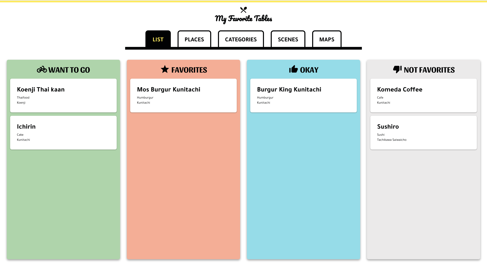
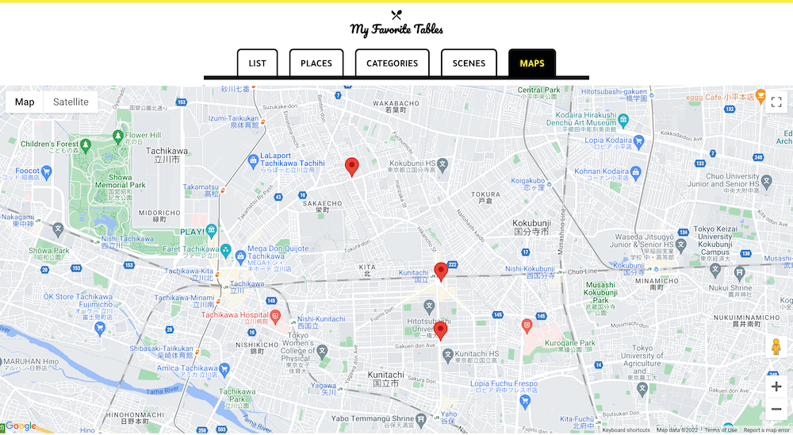

# My Favorite Tables (on going)

_NOTE: This project is still on going..._ 
This is the app to keep your favorite restaurants' information on boards.
It allows you to list, manage, and record those restaurants and your review.
In addition, you can search your restaurants' list by places, tags, and categories.

## Built With

- TypeScript
- React-Redux
- JavaScript
- SCSS

## Table of Contents

- [Built With](#built-with)
  <!-- - [Live Demo](#live-demo) -->
  <!-- - [Getting Started](#getting-started) -->
- [Author](#author)
  <!-- - [Contributing](#contributing) -->
- [Show your support](#show-your-support)
- [License](#license)
- [Acknowledgements](#acknowledgements)
- [Available Scripts](#available-scripts)

<!-- ## Live Demo

[Live Demo Link](https://yokosaka-weather-app.herokuapp.com/) -->

## Author

👤 **Yoko Saka**

- GitHub: [@yocosaka](https://github.com/yocosaka)
- Twitter: [@yocosaka](https://twitter.com/yocosaka)
- LinkedIn: [LinkedIn](https://www.linkedin.com/in/yokosaka)

## Show your support

Give a ⭐️ if you like this project!

## 📝 License

This project is [MIT](./LICENSE) licensed.

## Acknowledgements

- [@react-google-maps/api](https://github.com/JustFly1984/react-google-maps-api)
- [react-dnd](https://react-dnd.github.io/react-dnd/about)

## Available Scripts

In the project directory, you can run:

### `yarn start`

Runs the app in the development mode.\
Open [http://localhost:3000](http://localhost:3000) to view it in the browser.

The page will reload if you make edits.\
You will also see any lint errors in the console.

### `yarn build`

Builds the app for production to the `build` folder.\
It correctly bundles React in production mode and optimizes the build for the best performance.

The build is minified and the filenames include the hashes.\
Your app is ready to be deployed!

See the section about [deployment](https://facebook.github.io/create-react-app/docs/deployment) for more information.
